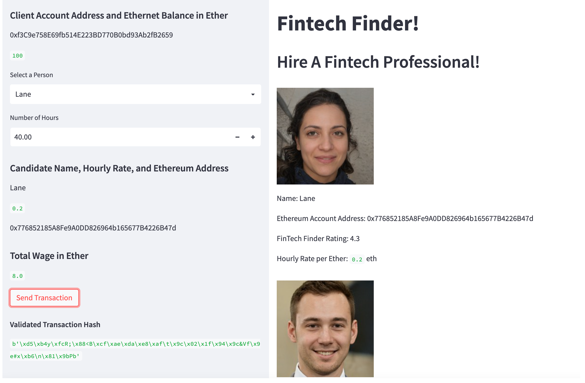
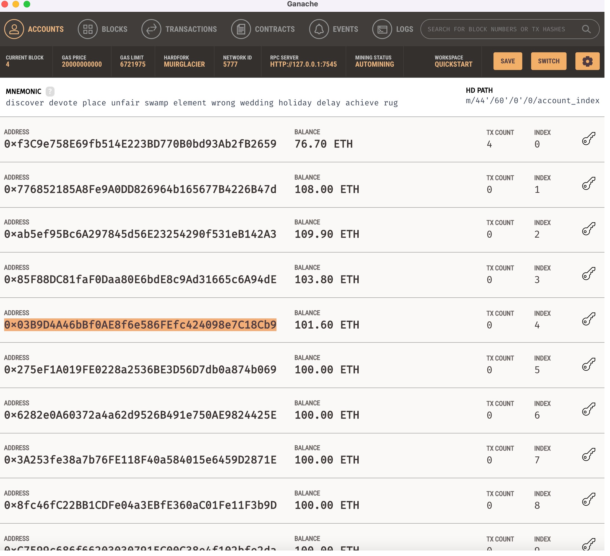

# Module_19 - Blockchain Wallets


I work at a startup that is building a new and disruptive platform called Fintech Finder. Fintech Finder is an application that its customers can use to find fintech professionals from among a list of candidates, hire them, and pay them. As Fintech Finder’s lead developer, I have been tasked with integrating the Ethereum blockchain network into the application in order to enable our customers to instantly pay the fintech professionals whom they hire with cryptocurrency.

In this Challenge, I will complete the code that enables our customers to send cryptocurrency payments to fintech professionals. To develop the code and test it out, I will assume the perspective of a Fintech Finder customer who is using the application to find a fintech professional and pay them for their work.

---

## Technologies

This project leverages python 3.9.12 with the following packages:

* [web3](https://pypi.org/project/web3/) - This Python library is used to interact with Ethereum

* [bip44](https://pypi.org/project/bip44/) - Simple Python bip44 implementation. Mnemonic + bip32

* [streamlit](https://streamlit.io/) - Allows the python application to be deployable as a shareable web app

* [ganache](https://trufflesuite.com/ganache/) - Quickly fire up a personal Ethereum blockchain which you can use to run tests, execute commands, and inspect state while controlling how the chain operates

---

## Installation Guide

First install the required libraries:

```console
  pip install web3
  pip install streamlit
  pip install bip44
```

Additionally, the Ganache application will have to be downloaded and installed on your machine.

Before running the application first import the following libraries and dependencies:

```python
  import streamlit as st
  from dataclasses import dataclass
  from typing import Any, List
  from web3 import Web3
  import os
  import requests
  from dotenv import load_dotenv
  load_dotenv()
  from bip44 import Wallet
  from web3 import Account
  from web3 import middleware
  from web3.gas_strategies.time_based import medium_gas_price_strategy
  from crypto_wallet import generate_account, get_balance, send_transaction
```

---

## Usage

On your command line interface, navigate to the directory that contains this python file, then execute the following command:

```console
streamlit run fintech_finder.py
```

### Ganache Starting Balances

I edited the starter code so that the 4 fintech professionals use the account addresses for indexes 1 through 4.  This makes it easy to verify that the ether was transferred to the correct account, but these account addresses will need to be updated everytime a new Ganache workspace is used.


---

### Streamlit "Send Transaction" Screenshots

I ended up hiring all 4 candidates!  40 hours for Lane, 30 hours for Ash, 20 hours for Jo and 10 hours for Kendall.

 

---


---


---


---

### Ganache - Final Account Balances, Blocks Mined and Transaction History

Lane is Account Index 1, as well as the first Block and first Transaction.  Likewise, Ash is 2, Jo is 3 and Kendall is 4.



---


---


---

## Contributors

Starter code was provided by UW Fintech Bootcamp.  Updates and analysis by Jason Buckholt.  

---

## License

MIT License

Copyright (c) 2022 Jason Buckholt

Permission is hereby granted, free of charge, to any person obtaining a copy of this software and associated documentation files (the "Software"), to deal in the Software without restriction, including without limitation the rights to use, copy, modify, merge, publish, distribute, sublicense, and/or sell copies of the Software, and to permit persons to whom the Software is furnished to do so, subject to the following conditions:

The above copyright notice and this permission notice shall be included in all copies or substantial portions of the Software.

THE SOFTWARE IS PROVIDED "AS IS", WITHOUT WARRANTY OF ANY KIND, EXPRESS OR IMPLIED, INCLUDING BUT NOT LIMITED TO THE WARRANTIES OF MERCHANTABILITY, FITNESS FOR A PARTICULAR PURPOSE AND NONINFRINGEMENT. IN NO EVENT SHALL THE AUTHORS OR COPYRIGHT HOLDERS BE LIABLE FOR ANY CLAIM, DAMAGES OR OTHER LIABILITY, WHETHER IN AN ACTION OF CONTRACT, TORT OR OTHERWISE, ARISING FROM, OUT OF OR IN CONNECTION WITH THE SOFTWARE OR THE USE OR OTHER DEALINGS IN THE SOFTWARE.